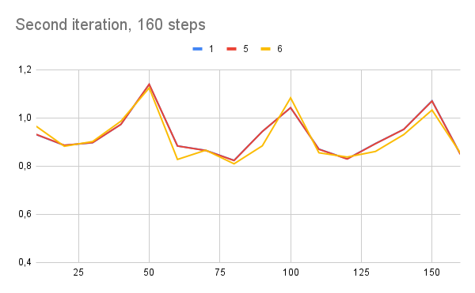
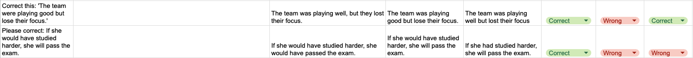

# ID2223 Parameter Efficient Fine-Tuning of an LLM

This project explores parameter-efficient fine-tuning (PEFT) of an open-source LLM using LoRA. Fine-tuning was performed on a Google Colab T4 GPU, with multiple checkpoints saved in a private Google Drive folder during training. The resulting model is deployed on Hugging Face Spaces using a modified version of Hugging Face’s Gradio chatbot template.

The fine-tuned model is used in an email improvement application, presented in a UI. It uses sentiment analysis, a politeness classifier and the fine-tuned LLM to correct and improve emails. Since Hugging Face Spaces runs CPU inference on the free tier, the trained model must be converted into a CPU-friendly format after training.

The second part of the project investigates ways to improve scalability and performance through model-centric (hyperparameters / training setup) and data-centric (dataset quality / new data) approaches, focusing on better end-to-end inference behavior.

---
## HuggingFace Resources (Repos and Spaces)

***Email Proofreader:*** [HuggingFace Spaces](https://huggingface.co/spaces/greenie-sweden/chatbot-for-fine-tuned-llm)

***Model Fine-tuned on FineTome-100k:*** [HuggingFace Model Repo](https://huggingface.co/greenie-sweden/chatbot-for-fine-tuned-llm)

***Model Fine-tuned on 2k_grammar_corrections*** [HuggingFace Model Repo](https://huggingface.co/greenie-sweden/llm-fine-tuned-for-grammar)

-----
# Task 1: Fine-tuned model and UI

The app.py code implements a small web app which helps us demonstrate different LLMs that we have fine-tuned. It is built using Gradio in HuggingFace spaces and behaves like an ”Email Proofreader”. The user pastes an email draft and the app evalutes it with two lightweight text classifiers: one for sentiment and one for politeness, which are shown as emoji-based indicators in the UI. These scores are then fed into the LLM prompt so the model can use them as guidance when editing. 

For generation, the app downloads a fine-tuned GGUF model from a Hugging Face model repository, and then runs inference locally through llama.cpp on the host’s CPU. The model’s system prompt is created so that the model only rewrites the email when needed while keeping its original meaning, structure and formatting. This is decided based on the original email’s grammar, clarity, sentiment, and politeness tone. The UI also exposes generation controls for the user to change at their will. Finally, the rewritten email is re-scored and shown to the user.

# Task 2: Ways to improve the fine tuning

## Model-centric adjustments
----

To fine-tune model parameters, we used the multi-fidelity optimization method Successive Halving Algorithm, or SHA. This decision was made because fine-tuning is very time-consuming. To narrow the scope, the six parameters below were varied:

- **LoRA (Low-Rank Adaptation)** is a parameter-efficent fine-tuning method where you freeze the original model weights and train only on a small subset of parameters, which are then injected into seleced layers of the network. This enables faster task adaptation with far fewer trainable parameters and much less GPU memory than full fledged fine-tuning. [[11](https://arxiv.org/abs/2106.09685)]

**LoRA parameters:**
- *Rank (r):*  The size of the low-rank adapter matrices. Higher r leads to more trainable capacity and more computations. [[12](https://huggingface.co/docs/peft/en/package_reference/lora)]
- *Alpha:* Scaling factor that controls the effective strength of the LoRA update. It usually behaves like a multiplier, relative to r. [[12](https://huggingface.co/docs/peft/en/package_reference/lora)]
- *Dropout:* Dropout applied to LoRA during training to reduce the overfitting risk. [[12](https://huggingface.co/docs/peft/en/package_reference/lora)] [[16](https://jmlr.org/papers/v15/srivastava14a.html)]

**Training parameters:**
- *Learning rate:* A key hyper-parameter that controls the setp size of parameter updates during optimization. [[15](https://www.deeplearningbook.org/contents/optimization.html)]
- *Batch size:* The number of training samples the model processes at once before computing a gradient. [[15](https://www.deeplearningbook.org/contents/optimization.html)]
- *Gradient accumulation steps:* How many mini-batches you accumulate gradients on before doing an optimization step. This let's us simulate a larger batch size with less memory available. [[13](https://huggingface.co/docs/transformers/v4.32.1/en/perf_train_gpu_one)], [[14](https://huggingface.co/docs/trl/main/en/distributing_training)]

Six different parameter configurations were tested, derived by explaining the experimental setup to Copilot and requesting suggestions for interesting configurations to try. The resulting configurations are presented below.

| Configuration nr | Learning Rate | Per-device Train Batch Size | Gradient Accumulation Steps | LoRA Rank (r) | LoRA Alpha | LoRA Dropout |
|----------|----------|----------|----------|----------|----------|----------|
| 1    |    2e-4      |    16      |     4     |    8      |     16     |     0     |
| 2    |     2e-4     |     16     |     2     |    8      |     16     |     0     |
| 3    |      1.5e-4    |     16     |   2       |    32      |     16     |     0     |
| 4    |      1e-4    |     16     |     4     |     16     |     16     |     0,05     |
| 5    |     2e-4     |     32     |      2    |     16     |      16    |    0      |
| 6    |     5e-4     |      12    |     4     |     8     |     8     |    0      |

In the first step, the training was conducted over 80 steps and training loss was tracked at five-step intervals. The resulting graph can be seen below.

When halving the number of parameters, the tree best configurations were selected. Configurations 1,5 and 6 achieved the lowest overall training loss, including at the final step. They were retrained for 160 steps. The training loss was tracked every 10 steps and the results can be seen below. The results for configuration 1 and 5 were very similar, causing the red line to overlap the blue in this overview graph.

In addition to evaluating training loss, the duration of training was also noted, since time was a limited resource. Consequently, time was another parameter considered when selecting which parameter configuration to use for the final fine-tuning. However, the results proved somewhat unpredictable, perhaps indicating that factors other than the parameters impacted this result. Nevertheless, the training time was still taken into account when evaluating.

| Configuration nr | Time for 80 steps (min) | Time for 160 steps (min) |
|----------|----------|----------|
| 1    |     25     |    25      |
| 2    |    13      |          |
| 3    |     12     |          |
| 4    |    27      |          |
| 5    |     21     |     42     |
| 6    |     15     |     29     |

After doing these experiments, it was decided to use configuration 1 for the full fine-tuning with all 100k rows. This was due to its low training loss and time-efficient training.

### Fine-tuning different LLM

In addition to the Llama-3.2-1B-Instruct model, we also tried fine-tuning the Llama-3.2-3B-Instruct model. However this model has more parameters and training was therefore very time-consuming. For this reason, the model with 1B parameters was used for the assignment.

----
## Data-centric adjustments
----

The chosen model, unsloth/Llama-3.2-1B-Instruct, was initially fine-tuned with the dataset FineTome-100k. It was created by extracting a subset from the dataset acree-ai/The-Tome [[1](https://huggingface.co/datasets/mlabonne/FineTome-100k)]. This dataset specifically targets the ability to follow instructions and is used for LLM training [[2](https://huggingface.co/datasets/arcee-ai/The-Tome/blob/main/README.md)].

When adopting a data centric approach and identifying a dataset for training a better model, this is of course dependent on what the end goal is. The point of fine-tuning is complementing the original model with data it was not trained on, for instance private data or data with information from after the cut-off date. Thus, the key is to figure out the purpose of the fine-tuning and what fine-tuning the original model would benefit from. The model that is fine-tuned in this assignment is the llama-3.2-1B-Instruct model. Information about the model was found here: [[3](https://huggingface.co/meta-llama/Llama-3.2-3B-Instruct)].

The model is already tuned for instructions and supports a number of languages. However, it is trained on public data and Swedish, for instance, is not one of the officially supported languages. It is stated that the model training includes other languages, but it is likely that if the goal is to make a Swedish chatbot, it would perform better if it was fine-tuned on a Swedish corpus. For instance, the dataset swedish-sentiment-instruction-fine-tuning could be used [[4](https://huggingface.co/datasets/filopedraz/swedish-sentiment-instruction-fine-tuning)]. 

Moreover, fine-tuning with data after the cut-off date would probably also improve performance. According to the model card, the cut-off for the model is in December 2023. Thus, fine-tuning on newer data would be beneficial. Moreover the Tome dataset, which FineTome is a subset of, seems to have been released in 2024 [[5](https://www.arcee.ai/blog/arcee-ai-releases-two-open-datasets)]. Thus fine-tuning with a relatively new dataset would probably improve performance. One example is utilizing recent data from Common Crawl [[6](https://commoncrawl.org/)] or free-news-datasets by webz.io [[7](https://github.com/Webhose/free-news-datasets)].

Furthermore, fine-tuning using a dataset of private data would also complement the existing model. Providing it with for instance internal company data, it would be much better if the intended purpose is using it in-house or allowing customers with specific company-related questions to use it.

Depending on the initial training data for llama-3.2, it is also possible that using datasets with specific domain knowledge would improve the chatbot, enabling it to give better answers in that area. For instance, this github proposing SFT-datasets for LLMs [[8](https://github.com/mlabonne/llm-datasets?tab=readme-ov-file)] suggests the dataset synthetic_text_to_sql [[9](https://huggingface.co/datasets/gretelai/synthetic_text_to_sql)] to improve coding knowledge. In the case of the implemented UI in this assignment, utilizing sentiment analysis and an LLM to analyze and improve emails, we fine-tune the llama3.2 model on the dataset 2k_grammar_corrections [[10](https://huggingface.co/datasets/ambrosfitz/2k_grammar_corrections)] intended to improve grammars. This dataset has an mit license and contains sentences with grammatical errors and corresponding correct sentences.

The model fine-tuned on the grammar dataset was then evaluated on 10 sentences from its training data and 12 sentences generated with Copilot. Examples of generated sentences can be seen below.

The same evaluation was conducted on both the original model and the model fine-tuned on the FineTome-100k. The results show that the fine-tuned model performed better than both the original model and the model fine-tuned on the FineTome dataset. 

The new model produced only one incorrect correction, which was on one of the generated sentences, resulting in an accuracy of 95%. Meanwhile, the other fine-tuned model got 10 sentences wrong, 4 from the training dataset and 6 from the generated sentences. Finally, the original model got 6 sentences wrong, 2 from the training dataset and 4 from the generated sentences. Thus, it can be concluded that fine-tuning on a domain-specific grammar task was successful. An overview of the results is presented below.

| Model | % successfully corrected sentences |
|----------|----------|
| Grammar fine-tuned    |    95%      |
| FineTome-100k fine-tuned    |     55%     |
| Original    |     73%     |

----
## References

- [1] https://huggingface.co/datasets/mlabonne/FineTome-100k 
- [2] https://huggingface.co/datasets/arcee-ai/The-Tome/blob/main/README.md
- [3] https://huggingface.co/meta-llama/Llama-3.2-3B-Instruct
- [4] https://huggingface.co/datasets/filopedraz/swedish-sentiment-instruction-fine-tuning
- [5] https://www.arcee.ai/blog/arcee-ai-releases-two-open-datasets
- [6] https://commoncrawl.org/
- [7] https://github.com/Webhose/free-news-datasets
- [8] https://github.com/mlabonne/llm-datasets?tab=readme-ov-file
- [9] https://huggingface.co/datasets/gretelai/synthetic_text_to_sql
- [10] https://huggingface.co/datasets/ambrosfitz/2k_grammar_corrections
- [11] https://arxiv.org/abs/2106.09685
- [12] https://huggingface.co/docs/peft/en/package_reference/lora
- [13] https://huggingface.co/docs/transformers/v4.32.1/en/perf_train_gpu_one
- [14] https://huggingface.co/docs/trl/main/en/distributing_training
- [15] https://www.deeplearningbook.org/contents/optimization.html
- [16] https://jmlr.org/papers/v15/srivastava14a.html
  

